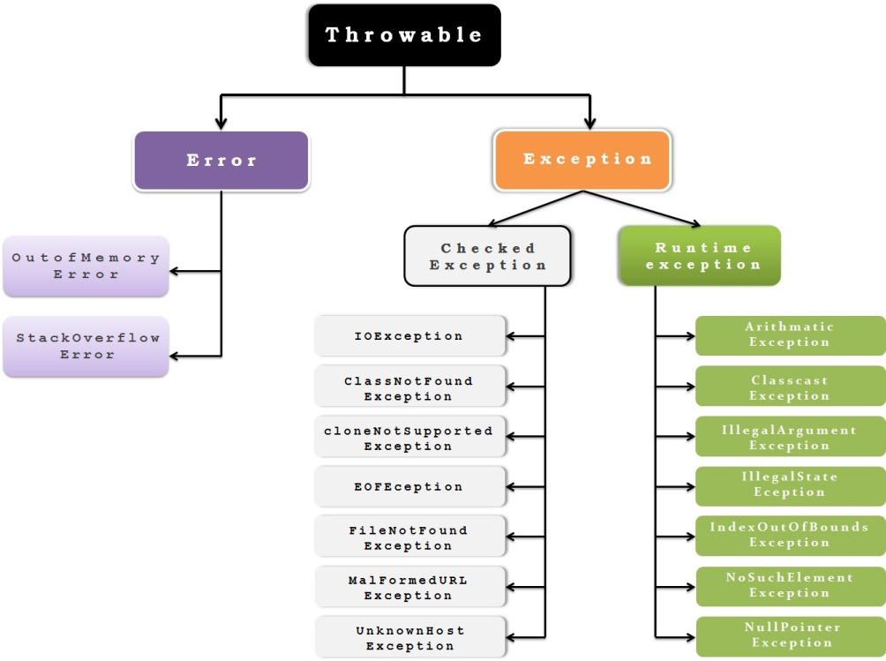

# Exceptions

- An exception is an event, which occurs during the execution of a program, that disrupts the normal flow of the program's instructions.

- Exceptions are frequently faced in a programming environment and handling them is an important task.

-Below is the simple example of exception

```java
class Exception {
public static void main(String[] args) {
    int x = 10, y= 0;
    System.out.println(x/y); // Divide by zero exception
}
```

## Exception propogation

- When an exception occurs then the message displayed on console is a stack trace. It gives us the details of exception like exception message, method call stack, exceptions location ...

- In Java, **java.lang.Exception** class is the superclass of all exception objects. These objects contain the stack trace and all information regarding the exception.

- JRE produces and throws the exception object whenever an exception occurs.

- The instant after an exception object is thrown, the program stops the execution.

- If the exception is not taken care of, then it is propagated to the calling environment. It can be either a runtime system or a calling method.

- When the JRE receives the exception, it terminates the program and shows the stack trace.

## Throwable hierarchy / Exception Types



- _Checked exceptions_ occur at compile time, and should be handled or declared for propagation. A well-written application should anticipate and recover from Chekcked Exception

- RunTime exceptions\_ occur at runtime, and need not be handled or declared for propagation. These exceptions are external to application and cannot be anticpated or recovered from.

- _Errors_ are exceptional conditions that are external to the application, and that the application usually cannot anticipate or recover from

- \_Checked exceptions\_\_ Errors and runtime exceptions are collectively known as unchecked exceptions.

- There are 3 useful methods in Throwable class :
  - getMessage( ) : Detail of exception description is returned.
  - toString( ) : A short description is returned.
  - printStrackTrace( ) : Detail of stack trace is returned.

## Exception Handler Components

- To make things easier, Java provides an excellent exception handling mechanisms.
- If an exception occurs in a method. There are two ways to handle it :

  - Handle the exception there itself
  - Propogate it to be handled at somewhere else

- _**try**_ : First step in constructing exception handler is to enclose the code that might throw an exception within a try block.

  - Sytax:

    ```java
         try {
            //code
         }
         catch and finally blocks . . .
    ```

  - _code_ in syntax contains one or more legal lines of code that could throw an exception.

  - Example:

    ```java
        class TryExample {
            public static void Main(String[] args) {
                int x=10,y=0;
                try {
                    int z = x/y; //line where exception is thrown
                    System.out.println(z);
                }
                catch and finally blocks . . .
            }
        }
    ```

    - If an exception occurs within the try block, that exception is handled by an exception handler associated with it. To associate an exception handler with a try block, you must put a catch block after it

- _**catch**_ : Second step in constructing exception handler is to add a catch block where exception handler handles the exception.

  - We can have multiple catch blocks but need to be differentiated for type of exception and it can be done by argument to catch block.

  - Catch block takes Exception Type as argument and must be the name of a class that inherits from the Throwable class.

  - No code should be written between the end of the try block and the beginning of the first catch block.

  - In the try block, the lines of code after the line which caused exception, are ignored.

  - Sytax:

    ```java
         try {
            //code which throws exception
         }
         catch(ExceptionType name) {
            //Steps to do after catching exception
         } catch(ExceptionType1 name) {
            //Steps to do after catching exception of type2
         }
    ```

  - _catch_ block in syntax can do error recovery, prompt the user to make a decision, or propagate the error up to a higher-level handler .

  - Example:

    ```java
        class TryCatchExample {
            public static void Main(String[] args) {
                int x=10,y=0;
                try {
                    int z = x/y; //line where exception is thrown
                    System.out.println(z);
                } catch(ArithmeticException e) {
                    System.out.println("The divisor should not be zero");
                }
            }
        }
    ```

    - Example for multiple catch blocks:

    ```java
        class TryCatchExample {
            public static void Main(String[] args) {
                int[] a = {10,2};
                try {
                    int z = a[1]/a[0]; //line where exception is thrown
                    System.out.println(z);
                    System.out.println(a[2]);
                } catch (ArrayIndexOutOfBoundsException e1){
                    System.out.println("Array index you tried to access is >= arraySize");
                } catch(ArithmeticException e) {
                    System.out.println("The divisor should not be zero");
                }
            }
        }
    ```

    - If the suitable catch block is not found, the exception remains unhandled and propagated.

    - If no exception gets thrown from the try block, their subsequent catch blocks are ignored.

    - Considering the Throwable hierarchy, Parent Exception catch should come after Child Exception catch. Eg: ArithmeticException catch should be before the Exception class catch

    - Example:

    ```java
        class TryCatchExample {
            public static void Main(String[] args) {
                int x=10,y=0;
                try {
                    int z = x/y; //line where exception is thrown
                    System.out.println(z);
                } catch(ArithmeticException e) {
                    System.out.println("The divisor should not be zero");
                } catch(Exception e1) {
                    System.out.println("Exception occurred");
                }
            }
        }
    ```

    - **BestPractice** : In a catch block, specific exceptions are preferred rather than general exceptions or unspecific exceptions.

    - In Java SE 7 and later, a single catch block can handle more than one type of exception. This feature can _reduce code duplication_ and _lessen the temptation to catch an overly broad exception_.

    - In the catch clause, specify the types of exceptions that block can handle, and separate each exception type with a vertical bar (|):

    - Example for single catch with multiple types :

    ```java
        class TryCatchExample {
            public static void Main(String[] args) {
                int[] a = {10,2};
                try {
                    int z = a[1]/a[0]; //line where exception is thrown
                    System.out.println(z);
                    System.out.println(a[2]);
                } catch (ArrayIndexOutOfBoundsException | ArithmeticException e) {
                    System.out.println("Exception Occurred : " + e.getMessage());
                }
            }
        }
    ```

- _**finally**_: When you want to execute few lines of code even if any exception occurs, then you need to write that code in a _finally_ block.

  - finally block always executes when the try block exits

  - finally block is executed even if an unexpected exception occurs.

  - **Note** : If the JVM exits while the try or catch code is being executed, then the finally block may not execute.

  - **BestPractice** : In a finally block, placing cleanupcode even if no exception is anticipated gives more control on application.

  - **Important** : finally block is a key tool for preventing _resource leaks_. When closing a file or otherwise recovering resources, place the code in a finally block to ensure that resource is always recovered.

  - Example for single catch with multiple types :

    ```java
        class TryCatchExample {
            public static void Main(String[] args) {
                int[] a = {10,2};
                try {
                    int z = a[1]/a[0]; //line where exception is thrown
                    System.out.println(z);
                    System.out.println(a[2]);
                } catch (ArrayIndexOutOfBoundsException | ArithmeticException e) {
                    System.out.println("Exception Occurred : " + e.getMessage());
                } finally {
                    System.out.println("Finally block executed");
                }
            }
        }
    ```

- _**throw**_ : Before catching an exception, some code somewhere must throw one. Any code can throw an exception: your code, code from a package written by someone else such as the packages that come with the Java platform, or the Java runtime environment. Regardless of what throws the exception, it's always thrown with the _throw_ statement.

  - Having exceptions with custom messages increases the readability of our applications.

  - Example:

  ```java
       class ThrowExample {
           public static void Main(String[] args) {
            try {
               int x=10,y=0;
               if (y == 0)
                   throw new Exception("The divisor should not be zero");
               int z = x / y;
               System.out.println(z);
           } catch (Exception e) {
               System.out.println(e.getMessage());
           }
       }
  ```

- _**throws**_ : If we need to propagate and handle the exceptions elsewhere then we need to use _throws_ keyword. If any method does not handle a checked exception, we must declare it with throws clause. If done so, exception will be propagated to calling method.

  - Having exceptions with custom messages increases the readability of our applications.

  - Example:

  ```java
       class ThrowsExample {
           public static void divide(int x, int y) throws Exception {
                if(y == 0)
                    throw new Exception("The divisor should not be zero");
                int z = x/y;
                System.out.println(z);
            }

           public static void Main(String[] args) {
               try {
                    divide(10, 0);
                }
                catch(Exception e) {
                    System.out.println(e.getMessage());
                }
           }
       }
  ```

## Advantages of Exceptions

- Separating Error-Handling Code from "Regular" Code
- Propagating Errors Up the Call Stack
- Grouping and Differentiating Error Types
